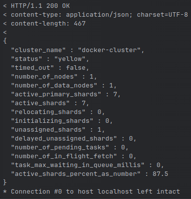
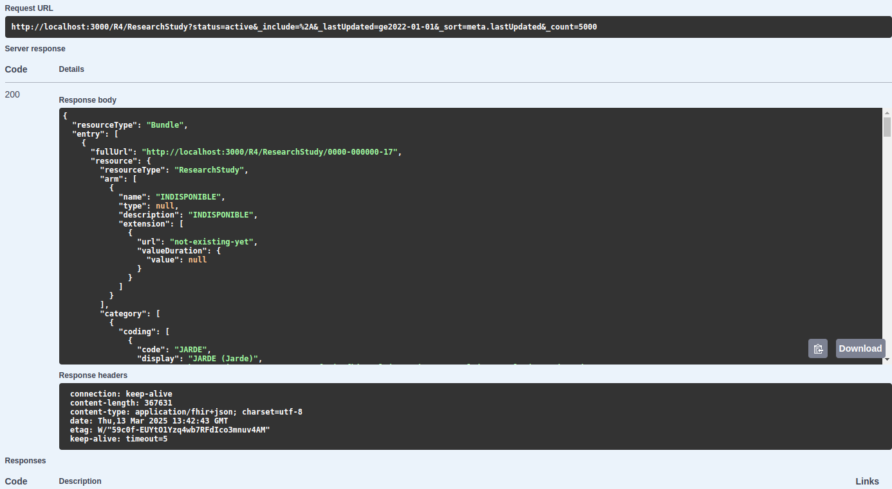

# API Eclaire - Plateforme nationale des essais cliniques - Ministère de la santé

## Pré-requis
- Avoir `podman` installé (https://podman.io/)
- Avoir `docker-compose-v2` installé (https://docs.docker.com/compose/releases/migrate/) 
- Installer `corepack`, l'activer puis gérer `yarn`
```bash 
npm install -g corepack
corepack enable
yarn set version stable
yarn
```

## Installation

```bash
yarn
cp .env.sample .env
```

Puis remplir les secrets.

## Utilisation

Vous trouverez toutes ces commandes dans le fichier package.json.

### Lancer l'application pour développer

Nécessite d'avoir lancé les containers et d'avoir chargé des informations
```bash
yarn start:db
yarn etl:hard-index-migration #OPTIONNEL
yarn dev
```
Tester le bon déploiement de l'infrastructure et le bon fonctionnement de l'application :
1. Vérifier que vous arrivez à communiquer avec la base de données Elasticsearch en local.  
Lancer la commande : `curl -v 'http://localhost:9200/_cluster/health?pretty'`  
La fin de la sortie attendue est la suivante :  

2. Vérifier que vous avez accès à l'interface swagger.  
Copier dans la barre de navigation de votre navigateur, l'URL suivante :  
`http://localhost:3000/`
3. Tester le service **GET - /R4/ResearchStudy** sans rentrer de paramètres.  
Étendre l'onglet du service puis cliquer sur le bouton `Try it out` et enfin cliquer sur le bouton `Execute`.  
La sortie attendue est la suivante :  


> Cette application fonctionne avec la dernière version LTS de node.

### Lancer l'application pour simuler la production

```bash
yarn build && yarn start
```

### Lancer les tests

Nécessite d'avoir lancé les containers 
```bash
yarn start:db
```

```bash
yarn test

yarn test:coverage

yarn test:mutation:api

yarn test:mutation:etl
```

### Lancer le linter

```bash
yarn lint
```

### Vérifier le typage

```bash
yarn typecheck
```

### Lancer la CI

```bash
yarn amibroken
```

### Vérifier qu'il n'y a pas de code mort

```bash
yarn deadcode
```

### Vérifier qu'il n'y a pas de dépendance inutile

```bash
yarn depcheck
```

### Se connecter au one-off de Scalingo (il faut avoir installé le CLI de Scalingo au préalable)

```bash
yarn bash:production
```

## Import MedDra
- Supprimer l'index meddra sur Elasticsearch s'il existe déjà
- Récupérer le fichier llt.asc qui est au format `Windows-1252` 
- Ouvrir le fichier avec un éditeur de code pour le sauvegarder avec l'encodage `UTF-8` et ainsi lire les caractères spéciaux correctement
- Renommer le fichier en `meddra-utf8.asc`
- Placer ce fichier à la racine du projet
- Exécuter la ligne bash suivante

```bash
yarn etl:meddra-import
```

## Guide d'implémentation et données implémentées
- Le guide officiel est disponible sur https://interop.esante.gouv.fr/ig/fhir/eclaire/
- Les données implémentées sont marquées par une coche sur l'image [mapping.png](documentation/images/mapping.png)

## Architectural Decision Records (ADR)

### Open source (30/03/23)

- Rien n'empêche le contraire
- On peut utiliser des outils gratuits d'observabilité
- C'est nul d'être fermé
- Projet d'état
- Open API

### Framework : NestJS (30/03/23)

- Facile d'utilisation
- Connu par une grosse majorité des développeurs
- Beaucoup de ressource sur Internet, très bonne documentation
- Très bien pour faire juste une API
- Pas de front

### Hébergeur : Scalingo (30/03/23)

- Hébergeur Français
- Facile d'utilisation
- Peu cher
- Interface très simple
- Certifié HDS
- Autonome
- Scalable

### Dépôt de code : GitHub (30/03/23)

- Connu de tous
- Facile d'utilisation
- CI gratuite

### Écrire le code en Anglais (30/03/23)

- Audit OMS : lecture du code

### Outils d'observabilité : Sentry (30/03/23)

- Facile d'utilisation
- Très répandu
- La DNUM nous fourni un compte par défaut
- Notification rapide dès qu'il y a une erreur en production
- Erreur très détailler pour mieux la corriger

### Gestion des variables d'environnement

- Les variables d'environnement ne contiennent pas de configuration
- Les secrets doivent être sur Scalingo
- En local, il y a un fichier `.env.sample` commité et vide et on le surcharge avec un fichier `.env`

### Code MedDra/label en Français en base de données (09/10/23)

- Facile et rapide d'implémentation
- Evite de faire trop d'appel à leur API
- Par contre, il faut mettre cette liste à jour tous les semestres

## Post-Mortems

### Liste des Post-Mortems du projet

- **2025-01-07** (transmis par mail aux équipes ministérielles) - 
  Le moteur de recherche Elasticsearch était en saturation mémoire suite à l'échec de l'installation de plugins sur Scalingo.  
  Les difficultés rencontrées par le moteur de recherche généraient des erreurs applicatives et renvoyaient des
  codes erreurs techniques aux clients.

### Puis-je écrire un Post-Mortem et comment contribuer ?

N'importe quel acteur ayant participé à l'analyse d'un événement inhabituel, peut rédiger un Post-Mortem.

Le modèle est disponible dans la documentation du projet : [20XX-XX-XX - template post-mortem à copier.md](documentation/post-mortem/20XX-XX-XX%20-%20template%20post-mortem%20à%20copier.md).  
Copiez alors le fichier en le nommant avec :
- La date à laquelle l'événement a été remonté
- Une courte explication compréhensible de l'événement

### Pourquoi et quand écrire un Post-Mortem ?

Les principaux objectifs de la rédaction d’un Post-Mortem sont :
- de s’assurer que l’incident est documenté,
- que toutes les causes sous-jacentes sont bien comprises,
- que des mesures préventives efficaces sont mises en place pour réduire la probabilité ou l’impact d’une récidive. 

On s’attend à ce qu’il y ait des Post-Mortems après tout événement indésirable important.   
Le processus Post-Mortem présente un coût inhérent en termes de temps ou d’efforts, nous choisissons donc délibérément quand en écrire un.  
Les déclencheurs habituels sont les suivants :
- Temps d’arrêt ou dégradation visible par l’utilisateur au-delà d’un certain seuil,
- Perte de données quelle qu’en soit la nature,
- Intervention d'un ou plusieurs ingénieurs sur appel (remise à zéro, réacheminement du trafic, etc.),
- Un délai de résolution supérieur à un certain seuil,
- Une défaillance de la surveillance (qui implique généralement la découverte manuelle d’un incident).

Rédiger un Post-Mortem n’est pas une punition, c’est une occasion d’apprendre pour toute l’entreprise.  
Le Post-Mortem doit se concentrer sur l’identification des causes de l’incident sans accuser un individu ou une équipe 
d’avoir eu un comportement mauvais ou inapproprié.  
C'est un principe essentiel de la **culture SRE**. 

### Comment éditer un Post-mortem au format PDF ?

#### Installations pré-requises

La suite des informations est spécifique au système de gestion de paquets **dpkg** présent dans certaines distributions 
**Linux** (Debian/Ubuntu).  
Il convient de les adapter à votre environnement de travail.

Installer les packages suivants :
1. texlive-latex-base 
2. texlive-fonts-recommended `#OPTIONNEL`
3. texlive-fonts-extra `#OPTIONNEL`
4. pandoc
5. wkhtmltopdf

#### Procédure d'édition Post-mortem PDF

Pour palier a des limitations d'affichage en passant directement du format markdown au format PDF avec `pandoc`, 
on exécute les étapes intermédiaires suivantes :

1. Ouvrir un Terminal et se placer dans votre répertoire [documentation/post-mortem](documentation/post-mortem) du projet en local,   
2. Convertir la version markdown d'origine en version HTML via la librairie `pandoc` avec la commande suivante :  
   ```
   pandoc '<Remplacer par le nom du fichier post-mortem>.md' -o 'Post-mortem-intermédiaire-format-web.html' --standalone
   ```
3. Éditer le fichier `Post-mortem-intermédiaire-format-web.html` pour supprimer le paramètre CSS suivant :
   ```html
   <head>
     ...
     <style>
       body {
         ...
         max-width: 36em; /* LIGNE A SUPPRIMER */
         ...
       }
     </style>
   </head>
   ```
4. Convertir le format HTML en fichier PDF via la librairie `wkhtmltopdf`.
   ```
   wkhtmltopdf --enable-local-file-access --orientation Landscape 'Post-mortem-intermédiaire-format-web.html' '<Remplacer par le nom du fichier post-mortem>.pdf'
   ```
   Voici à quoi servent les options présentes :
   - `--enable-local-file-access` autorise l'accès aux images présentes sur votre disque pour les intégrer dans le fichier PDF,
   - `--orientation Landscape` oriente les pages du document PDF au format Paysage pour faciliter la lecture.
5. Le fichier `<Remplacer par le nom du fichier post-mortem>.pdf` est maintenant disponible dans votre répertoire local 
   [documentation/post-mortem](documentation/post-mortem) du projet.
